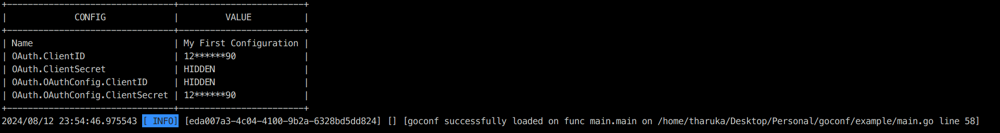

# Go Config
Library to load env configuration

**Note: This is a fork of [wgarunap/goconf](https://github.com/wgarunap/goconf)**

### How to use it

```go
package main

import (
	"errors"
	"os"

	"github.com/caarlos0/env/v6"
	"github.com/tlmanz/goconf"
	"github.com/tryfix/log"
)

type Conf struct {
	Name  string `env:"MY_NAME"`
	OAuth OAuth
}

type OAuth struct {
	ClientID     string `env:"CLIENT_ID" envDefault:"1234567890" hush:"mask"`
	ClientSecret string `env:"CLIENT_SECRET" envDefault:"1234567890" hush:"hide"`
	OAuthConfig  OAuthConfig
}

type OAuthConfig struct {
	ClientID     int64 `env:"CLIENT_ID" envDefault:"1234567890" hush:"hide"`
	ClientSecret int64 `env:"CLIENT_SECRET" envDefault:"1234567890" hush:"mask"`
}

var Config Conf

func (Conf) Register() error {
	return env.Parse(&Config)
}

func (Conf) Validate() error {
	if Config.Name == "" {
		return errors.New(`MY_NAME environmental variable cannot be empty`)
	}
	return nil
}

func (Conf) Print() interface{} {
	return Config
}

func main() {
	_ = os.Setenv("MY_NAME", "My First Configuration")

	err := goconf.Load(
		new(Conf),
	)
	if err != nil {
		log.Fatal(err)
	}
	if Config.Name != `My First Configuration` {
		log.Fatal(`error while comparing config`)
	}

	log.Info(`goconf successfully loaded`)
}
```

## Example Output ##
