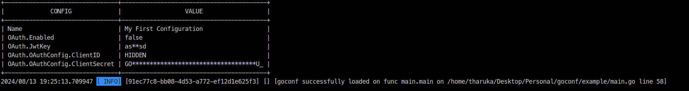

[](https://github.com/tlmanz/goconf/actions/workflows/ci.yml)
[](https://github.com/tlmanz/goconf/actions/workflows/codequality.yml)
[](https://coveralls.io/github/tlmanz/goconf)

[](https://goreportcard.com/report/github.com/tlmanz/goconf)


# Go Config
Library to load env configuration

**Note: This is a fork of [wgarunap/goconf](https://github.com/wgarunap/goconf)**

## Features
- Load configuration from environment variables
- Validate configuration
- Print configuration in a table format
- Mask or hide sensitive information

## Installation
```bash
go get github.com/tlmanz/goconf
```

## How to use it

1. Define your configuration struct:

```go
type Conf struct {
	Name  string `env:"MY_NAME"`
	OAuth OAuth
}

type OAuth struct {
	Enabled     bool   `env:"OAUTH_ENABLED" envDefault:"False"`
	JwtKey      string `env:"JWT_KEY" envDefault:"asdasd" hush:"mask"`
	OAuthConfig OAuthConfig
}

type OAuthConfig struct {
	ClientID     string `env:"CLIENT_ID" envDefault:"234234234-23234kjh23jk4g2j3h4gjh23g4f.apps.googleusercontent.com" hush:"hide"`
	ClientSecret string `env:"CLIENT_SECRET" envDefault:"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10U_" hush:"mask"`
}

var Config Conf

func (Conf) Register() error {
    return env.Parse(&Config)
}

func (Conf) Validate() error {
    if Config.Name == "" {
        return errors.New(`MY_NAME environmental variable cannot be empty`)
    }
    return nil
}

func (Conf) Print() interface{} {
    return Config
}
```

2. Load the configuration:

```go
func main() {
    _ = os.Setenv("MY_NAME", "My First Configuration")

    err := goconf.Load(
        new(Conf),
    )
    if err != nil {
        log.Fatal(err)
    }
    if Config.Name != `My First Configuration` {
        log.Fatal(`error while comparing config`)
    }

    log.Info(`goconf successfully loaded`)
}
```

## Example Output ##
